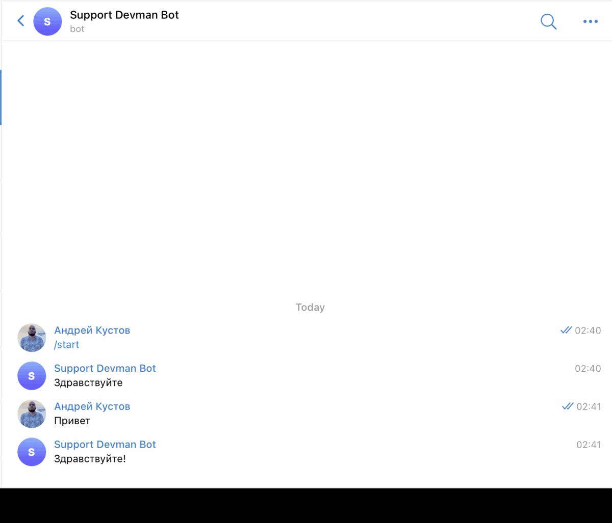

# Бот для службы поддержки

Бот для службы поддержки для telegram и vk, может отвечать пользователю на сообщения.
Распознает сообщения с помощью интеграции с DialogFlow от Google
## Окружение

### Как установить
```
python -m pip install pipenv (если не установлен pipenv)
pipenv shell
pipenv install
```

### Переменные окружения:
```
TG_BOT_TOKEN - токет телеграм бота
SESSION_ID - id сессии для DialogFlow (подойдет любое значение)
PROJECT_ID - id проекта в DialogFlow
GOOGLE_APPLICATION_CREDENTIALS - путь до google cloud credentials
VK_ACCESS_TOKEN - токен сообщества в vk
```

### Запуск

#### Telegram
 ```
 python tg.py
 ```

#### VK
```
python vk.py
```

#### Обучить DialogFlow агента
Положите рядом с файлом ```train_agent.py``` json файл ```training_dataset.json```
Пример файла
```
{
    "Устройство на работу": {
        "questions": [
            "Как устроиться к вам на работу?",
            "Как устроиться к вам?",
            "Как работать у вас?",
            "Хочу работать у вас",
            "Возможно-ли устроиться к вам?",
            "Можно-ли мне поработать у вас?",
            "Хочу работать редактором у вас"
        ],
        "answer": "Если вы хотите устроиться к нам, напишите на почту game-of-verbs@gmail.com мини-эссе о себе и прикрепите ваше портфолио."
    },
    "Забыл пароль": {
        "questions": [
            "Не помню пароль",
            "Не могу войти",
            "Проблемы со входом",
            "Забыл пароль",
            "Забыл логин",
            "Восстановить пароль",
            "Как восстановить пароль",
            "Неправильный логин или пароль",
            "Ошибка входа",
            "Не могу войти в аккаунт"
        ],
        "answer": "Если вы не можете войти на сайт, воспользуйтесь кнопкой «Забыли пароль?» под формой входа. Вам на почту прийдёт письмо с дальнейшими инструкциями. Проверьте папку «Спам», иногда письма попадают в неё."
    },
    "Удаление аккаунта": {
        "questions": [
            "Хочу удалить аккаунт",
            "Удалить аккаунт",
            "Как удалить аккаунт",
            "Как удалить данные обо мне",
            "Удалить мои статьи",
            "Как снести свой аккаунт"
        ],
        "answer": "Если вы хотите удалить аккаунт, это можно сделать в вашем профиле в разделе «Настройки». Пролистайте этот раздел до зоны, выделенной красным."
    },
    "Вопросы от забаненных": {
        "questions": [
            "Меня забанили",
            "Я в бане",
            "Разбаньте",
            "Разбаньте моего друга",
            "Разбаньте меня",
            "Почему я забанен",
            "За что меня забанили",
            "Можно-ли купить разбан?",
            "Хочу купить разбан",
            "Мой друг ничего не сделал, а его забанили"
        ],
        "answer": "Если вы забанены, вы нарушили правила нашего сообщества. При входе на сайт вы можете увидеть доказательства ваших нарушений и ссылку на нарушенное правило. Разбан не продаётся. Если вы ознакомились с правилами и доказательствами вашей вины и у вас всё ещё есть претензии — воспользуйтесь формой «Не виновен» под сообщением о бане."
    },
    "Вопросы от действующих партнёров": {
        "questions": [
            "Где проходит совещание",
            "Когда переведёте деньги по контракту",
            "Скоро переведу деньги по контракту",
            "Задерживаемся на совещание",
            "Высылаю итоги совещания",
            "Когда подписываем контракт?",
            "Контракт уже в силе?"
        ],
        "answer": "Простите, в этом чате сидит SMM-отдел, мы не знаем ответа на этот вопрос. Обратитесь напрямую к сотруднику, с которым работаете."
    }
}
```
Далее запуск кода:
```
python train_agent.py
```

